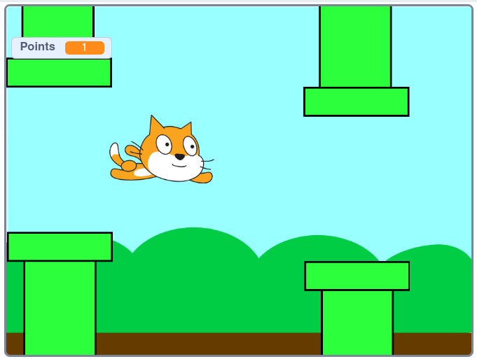
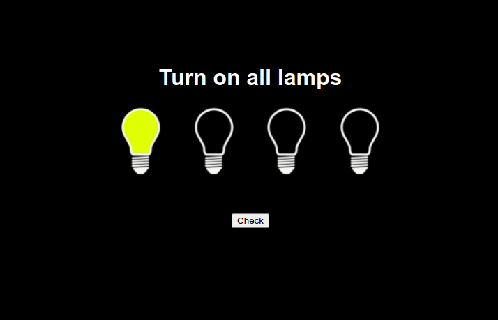
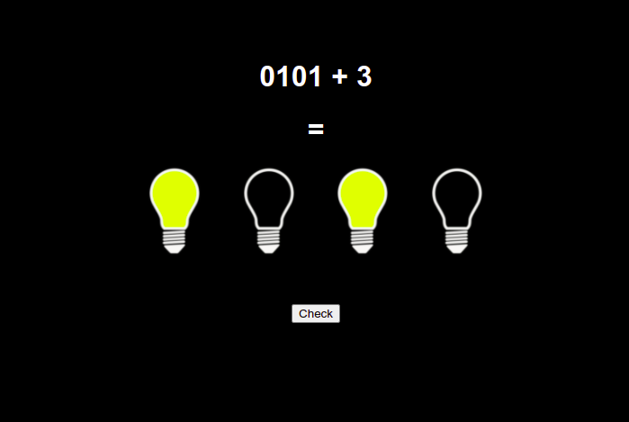
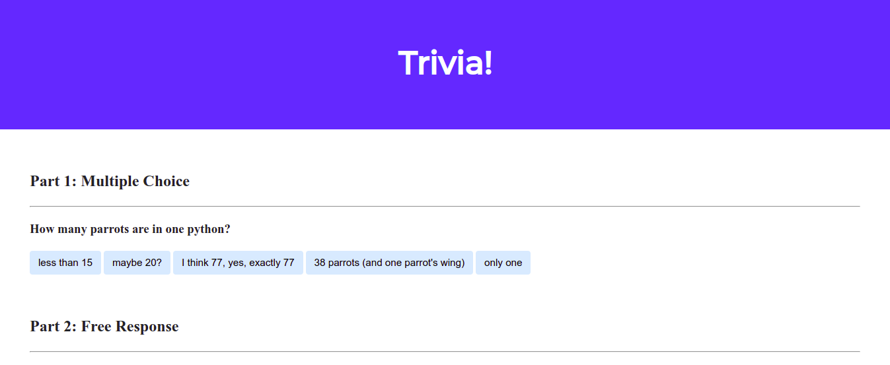
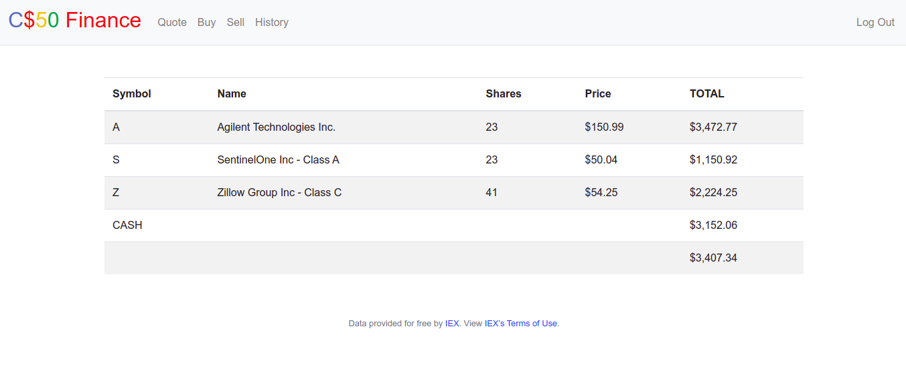
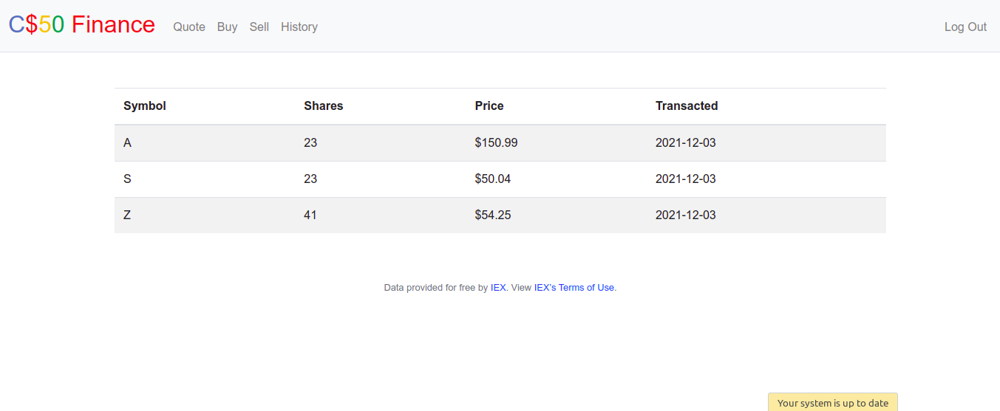
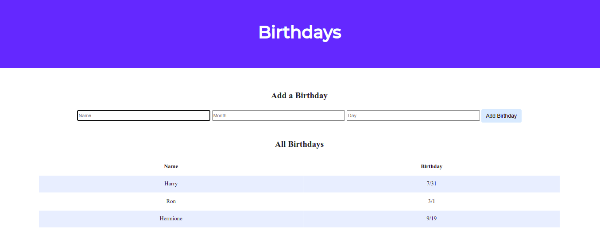

# CS50
This repository presents some of the projects completed during the open course from Harvard University CS50 (Computer Science 50). To learn more about the course visit the official website: https://cs50.harvard.edu

## Table of contents
* [Problem set 0](#problem-set-0)
  * [Flappy cat](#flappy-cat)
* [Problem set 1](#problem-set-1)
  * [Mario](#mario)
* [Problem set 2](#problem-set-2)
  * [Caesar](#caesar)
  * [Readability](#readability)
* [Problem set 3](#problem-set-3)
  * [Plurality](#plurality)
  * [Runoff](#runoff)
* [Problem set 4](#problem-set-4)
  * [Filter](#filter)
  * [Recover](#recover)
  * [Copy](#copy)
  * [Resize](#resize)
* [Problem set 5](#problem-set-5)
  * [Speller](#speller)
* [Problem set 6](#problem-set-6)
  * [DNA](#dna)
* [Problem set 7](#problem-set-7)
  * [Houses](#houses)
  * [Movies](#movies)
* [Problem set 8](#problem-set-8)
  * [Light bulbs](#light-bulbs)
  * [Trivia](#trivia)
* [Problem set 9](#problem-set-9)
  * [Finance](#finance)
  * [Birthdays base](#birthdays-base)

---
## Technologies
Technologies used:
* C
* Python 3
* Flask
* SQL
* HTML + CSS + JS


---
## Setup

Clone the repository to your pc:
```
$ git clone https://github.com/Banny501/cs50.git
```

Please note that to run C programs you need a clang compiler, Python 3 versions are needed for Python programs, and some programs will also need to install certain libraries.

Instructions for starting all programs are presented below.

---

## Problem set 0:
### Flappy cat:
Analogue of the game flappy bird.



#### Task:
**In zero problem set, you need to make a program in a Scratch programming language.**

#### Usage:
* Open the site https://scratch.mit.edu
* Click create -> File -> Load from your computer
* Select the archive with the game
* Click the green flag to start and enjoy.

---
## Problem set 1:
### Mario
#### Task:
**Write a program that draws pyramids from # symbols, like in a mario game.**


#### Installation:
* Make sure you have clang.
* Install cs50 library (https://cs50.readthedocs.io/libraries/cs50/c/)
```
$ make mario
```

#### Usage:
```
$ ./mario
```
Enter the height of the pyramid (positive integer between 0 and 8)

---
### Credit
#### Task:
**Implement a program that checks the bank card number, whether it exists and to which bank issued the card.**
```
$ ./credit 
Number: 4003600000000014
VISA
`````

#### Usage:
```
$ ./credit
```
* enter the bankcard number

---
## Problem set 2:
### Caesar
#### Task:
**Implement a program that encrypts messages using Caesar’s cipher, per the below.**
```
$ ./caesar 13
plaintext:  HELLO
ciphertext: URYYB
```


#### Installation:
* Make sure you have clang.
* Install cs50 library (https://cs50.readthedocs.io/libraries/cs50/c/)
```
$ make caesar
```

#### Usage:
```
$ ./caesar <key>
```
`key` - character offset number

Enter the text you want to encrypt and press enter.

---
### Readability
#### Task:
**Implement a program that calculates the Coleman-Liau Index (The Coleman-Liau Text Index is designed to display what (American) learning level is required to understand the text.).**

#### Installation:
* Make sure you have clang.
```
$ make readability
```

#### Usage:
```
$ ./readability 
```
Enter the text you want to check and press enter.

---
## Problem set 3:

### Plurality
#### Task:
**Implement a program that runs a plurality election, per the below.**
```
$ ./plurality Alice Bob Charlie
Number of voters: 4
Vote: Alice
Vote: Bob
Vote: Charlie
Vote: Alice
Alice
`````

#### Usage:
```
$ ./plurality {candidates}
```
* enter the number of voters
* vote

---
### Runoff
#### Task:
**Implement a program that runs a runoff election, per the below.**
```
$ ./runoff Alice Bob Charlie
Number of voters: 3
Rank 1: Alice
Rank 2: Bob
Rank 3: Charlie

Rank 1: Alice
Rank 2: Charlie
Rank 3: Bob

Rank 1: Bob
Rank 2: Charlie
Rank 3: Alice

Alice
```

#### Usage:
```
$ ./runoff <candidates>
```
* enter the number of voters
* vote

---
## Problem set 4:
### Filter
#### Task:
**Implement a program that applies filters to BMPs, per the below.**
```
$ ./filter -r image.bmp reflected.bmp
```

#### Installation:
Make sure you have clang.
```
$ make filter
```

#### Usage:
```
$ ./filter -[gsrb] {infile} {outfile}
```
`-g`  converts the image to black and white version 

`-s`  converts the image to sepia version

`-r`  reflects the image horizontally

`-b`  blurs the image

---
### Recover
#### Task:
**Implement a program that recovers deleted photos from a memory card image.**

#### Installation:
Make sure you have clang.
```
$ make recover
```

#### Usage:
```
$ ./recover <infile>
```

---
### Copy
#### Task:
**Implement a program that creates a bitwise copy of bmp files.**

#### Installation:
Make sure you have clang.
```
$ make copy
```

#### Usage:
```
$ ./copy <infile> <outfile>
```

---
### Resize
#### Task:
**Implement a program that resizes 24-bit uncompressed BMPs in `factor`.**

#### Installation:
Make sure you have clang.
```
$ make resize
```

#### Usage:
```
$ ./resize <factor> <infile> <outfile>
```
`factor` - how many times to enlarge the image (from 1 to 100)

---
## Problem set 5:
### Speller
#### Task:
**Implement a program that spell-checks a file, using a trie.**

#### Installation:
Make sure you have clang.
```
$ make speller
```

#### Usage:
```
$ ./speller {dictionary} {text}
```
`dictionary` - file containing a list of words
* alphabetically sorted from top to bottom
* one word per line, each of which ends with \n
* words should not be longer than `LENGTH` (a constant defined in dictionary.h)
* no word is repeated more than once
* each word contain only lowercase alphabetical characters and possibly apostrophes, and that no word will start with an apostrophe

`text` - file to be spell-checked

---
## Problem set 6:
### DNA
#### Task:
**Implement a program that identifies a person based on their DNA, per the below.**
```
$ python dna.py data/large.csv sequences/5.txt
Lavender
```

#### Usage:
```
$ python dna.py <data> <sequence>
```
`sequence` - text file containing the DNA sequence as a string consisting of adenine (A), cytosine (C), guanine (G) and thymine (T)
```
CGCAAAGACTTTATTGCGCCCACAGTGGCTTTTGACAGTGGCT
```

`data` - a CSV file where each row corresponds to an individual person and each column corresponds to a specific dna sequence as shown below.

```
name,AGAT,AATG,TATC
Alice,28,42,14
Bob,17,22,19
Charlie,36,18,25
```

---
## Problem set 7:
### Houses
#### Task:
Implement a program to import student data into a database, and then produce class rosters.

```
$ python import.py characters.csv
$ python roster.py Gryffindor

Lavender Brown, born 1979
Colin Creevey, born 1981
Seamus Finnigan, born 1979
Hermione Jean Granger, born 1979
Neville Longbottom, born 1980
Parvati Patil, born 1979
Harry James Potter, born 1980
Dean Thomas, born 1980
Romilda Vane, born 1981
Ginevra Molly Weasley, born 1981
Ronald Bilius Weasley, born 1980
```

#### roster.py
Imports data from a CSV spreadsheet in the `students.db` database.

#### Usage:
```
$ python import.py <file>
```

#### roster.py
Prints a list of students for a given `house` in alphabetical order.

#### Usage:
```
$ python roster.py <house>
```

---
### Movies
#### Task:
**Write SQL queries to answer questions about a database of movies.**

Each `*.sql` file of this directory contains a SQL request that displays the answer to the corresponding question. 
The directory also contains file called `movies.db`, a SQLite database that stores data from IMDb about movies, the people who directed and starred in them, and their ratings. 
The questions are in the file questions.txt.

#### Usage:
To test queries, you can query the database by running
```
$ cat filename.sql | sqlite3 movies.db
```
`filename.sql` is the file containing SQL query.


---
## Problem set 8:
### Light bulbs
#### Task:
**Build a page using HTML, CSS, and JavaScript.**

A simple quest where you need to light the lights.




---
### Trivia
#### Task:
**Write a webpage that lets users answer trivia questions.**



---
## Problem set 9:
### Finance
#### Task:
**Implement a website via which users can “buy” and “sell” stocks.**




#### Install:
Install requirements
```
$ pip install -r requirements.txt
```

You need to register to get an API key to be able to request IEX data. To do so, follow these steps:

* Visit https://iexcloud.io/cloud-login#/register/
* Select the “Individual” account type, then enter your email address and a password, and click “Create account”.
* Once registered, scroll down to “Get started for free” and click “Select Start” to choose the free plan.
* Once you’ve confirmed your account via a confirmation email, visit https://iexcloud.io/console/tokens.
* Copy the key that appears under the Token column (it should begin with pk_).

```
$ export API_KEY=Token
```

#### Usage:
```
$ flask run
```

---
### Birthdays base
#### Task:
**Create a web application to keep track of friends’ birthdays.**



#### Install:
Install requirements
```
$ pip install -r requirements.txt
```

#### Usage:
```
$ flask run
```